- title : Deep Dream Image Generation with F# 
- description : Introduction to generating deap dream images with F#
- author : Robert Pickering
- theme : night
- transition : default

***

### What is Deep Dreaming?

Deep dreaming is the process of generating images using a deep neural network built for image recognition.

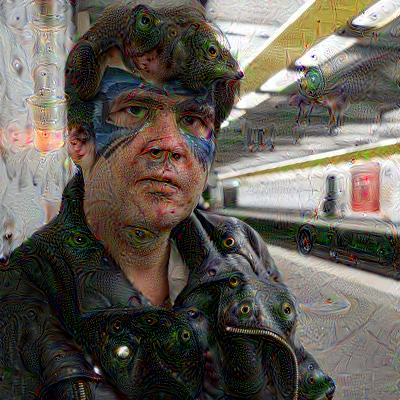

***

### Neural Networks

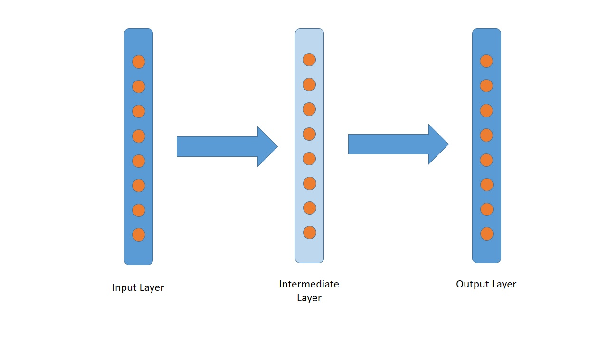

***

### Deep Neural Networks

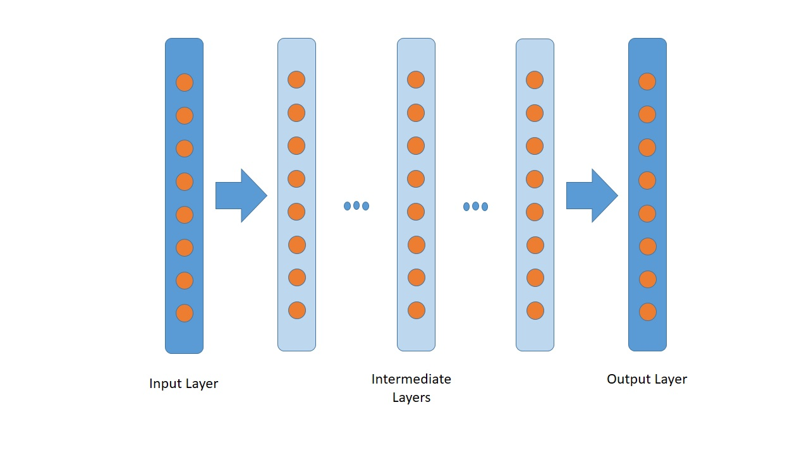

***

### Image Recognition

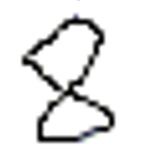

    val bytes : byte [] =
      [|66uy; 77uy; 246uy; 7uy; 0uy; 0uy; 0uy; 0uy; 0uy; 0uy; 54uy; 4uy; 0uy; 0uy;
        40uy; 0uy; 0uy; 0uy; 32uy; 0uy; 0uy; 0uy; 30uy; 0uy; 0uy; 0uy; 1uy; 0uy; |] // ...

***

### Image Recognition

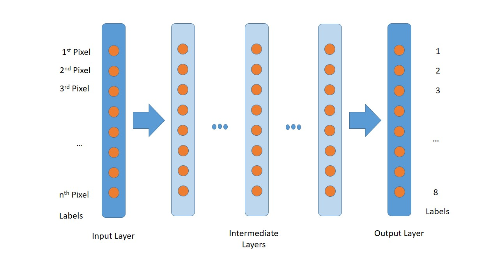

***

### Image Recognition

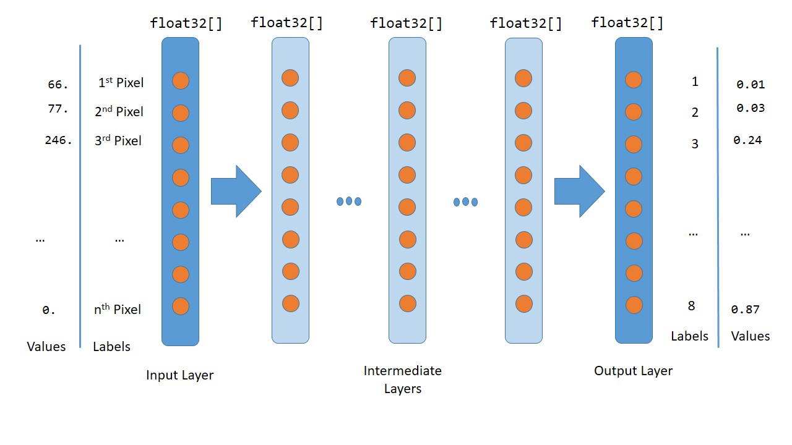

***

### Image Recognition

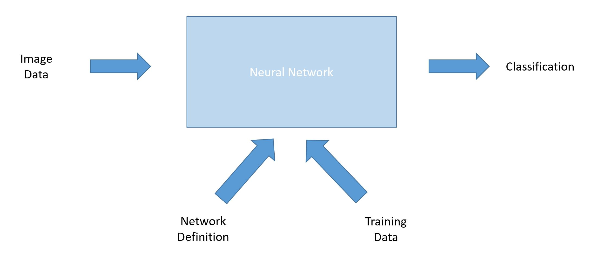

***

### Try it!

    [lang=cs]
    build.cmd ExecuteClassification
    
    cd bin\classification
    classification.exe ..\..\models\bvlc_reference_caffenet\deploy.prototxt 
        ..\..\models\bvlc_reference_caffenet\bvlc_reference_caffenet.caffemodel 
        ..\..\data\ilsvrc12\imagenet_mean.binaryproto 
        ..\..\data\ilsvrc12\synset_words.txt 
        ..\..\data\maxcat.jpg
    

***

### Try using flickr 

Use flickr api to get random pictures of animals

    [lang=cs]
    data\scripts\flickr.fsx

***

### Deep Dream

Creates images by recognizing elements with in an image then enhancing them

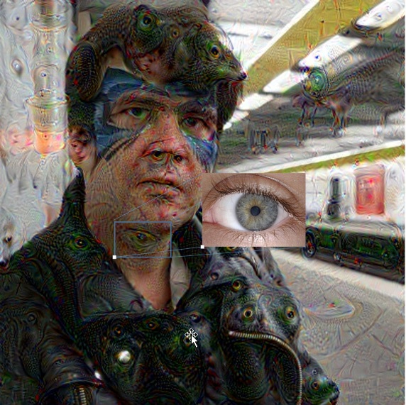

***

### Deep Dream

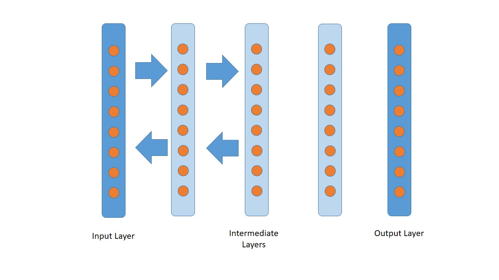

***

### Zooms

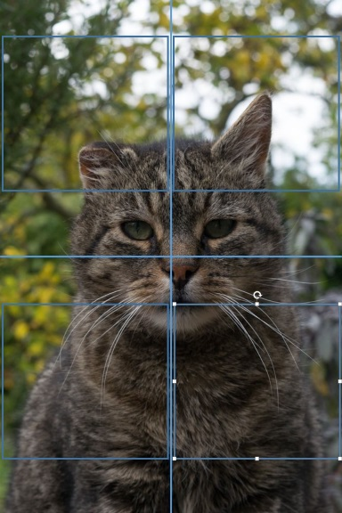

***

### Try it!

    [lang=cs]
    build.cmd ExecuteClassification
    
    cd bin\deepdream
    deepdream.exe ..\..\models\bvlc_googlenet\deploy.prototxt 
        ..\..\models\bvlc_googlenet\bvlc_googlenet.caffemodel 
        ..\..\data\ilsvrc12\imagenet_mean.binaryproto 
        ..\..\data\maxcat.jpg
    
***

### Try different layers

    [lang=cs]
    deepdream.exe 
        ..\..\models\bvlc_googlenet\deploy.prototxt 
        ..\..\models\bvlc_googlenet\bvlc_googlenet.caffemodel 
        ..\..\data\ilsvrc12\imagenet_mean.binaryproto 
        ..\..\data\maxcat.jpg 
        inception_3b/5x5_reduce

        
***

### Try iterations

    // first add the data to the blob
    inputBlob.SetData(data)

    for i in 1 .. 10 do // change me!
        // first get the blobs data
        let inputData = inputBlob.GetData()

***

### Try different zooms

    //load the image into an array formatted for use with caffe
    let size, mean, allChannels = loadImageIntoArray imgFile meanFile

    // zoom over different levels of the image to help the net find different element
    for zoomFactor in 4 .. -1 .. 1  do // change me!

        time (sprintf "zoom %i" zoomFactor) (fun () ->
***

### Try using flickr 

Use flickr api to get random to deep dream

    [lang=cs]
    data\scripts\flickr.fsx
    
***

### Try creating animations

    [lang=cs]
    data\scripts\animatedGifs.fsx

***

### Try different models

https://github.com/BVLC/caffe/wiki/Model-Zoo    

https://github.com/google/deepdream/blob/master/dream.ipynb

***

### Thanks Phil!

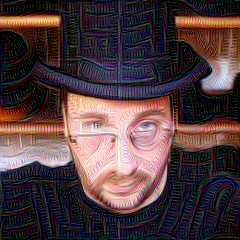

***

### Thanks Mathias!

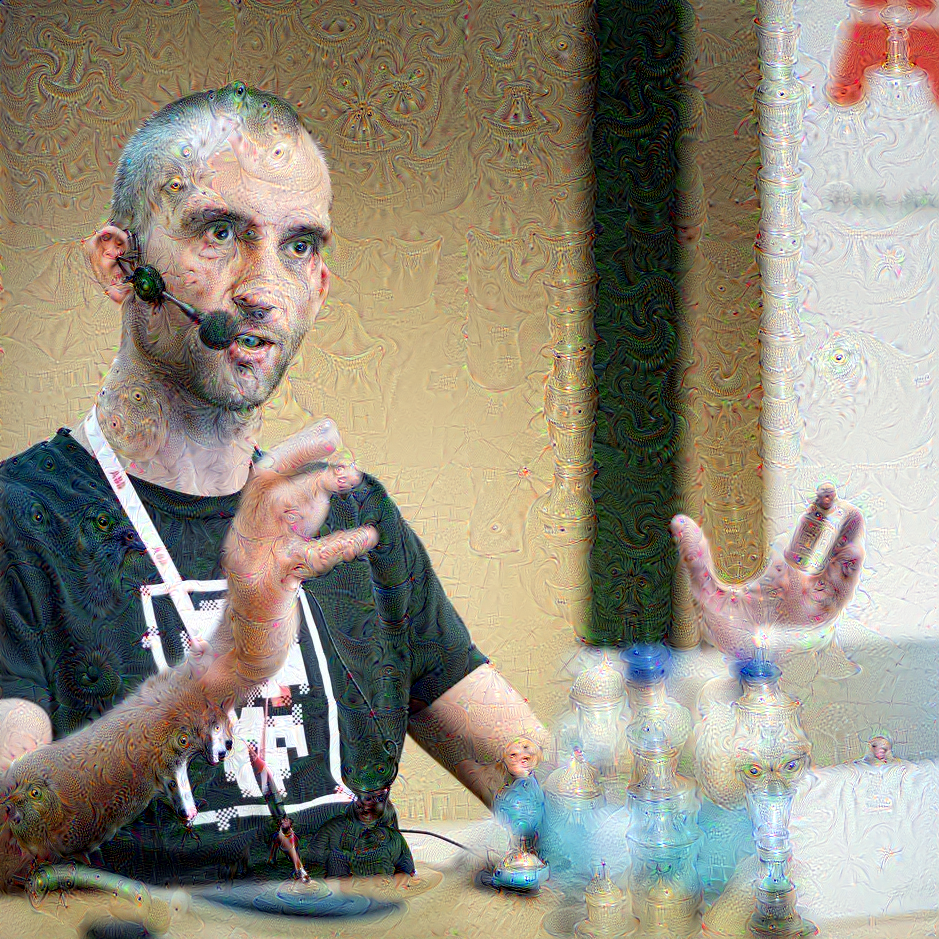
